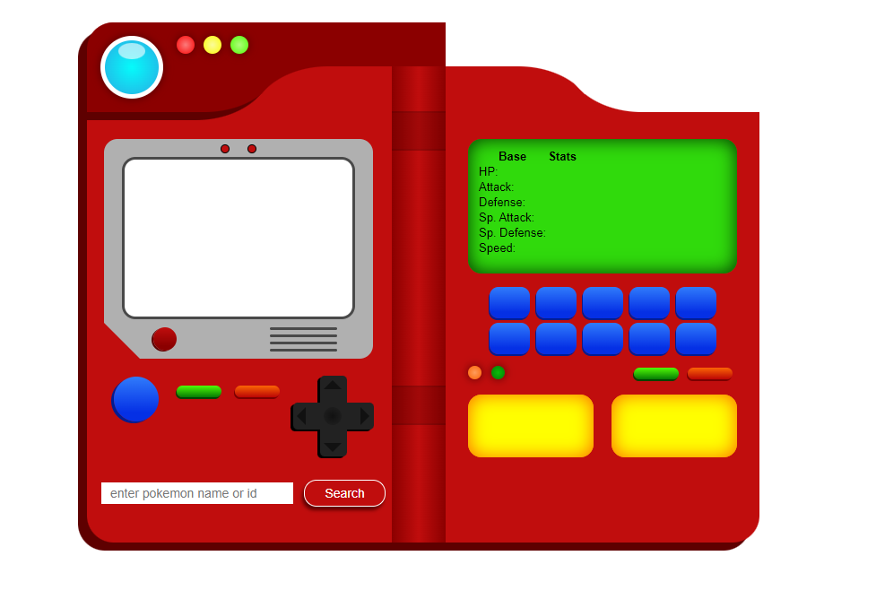
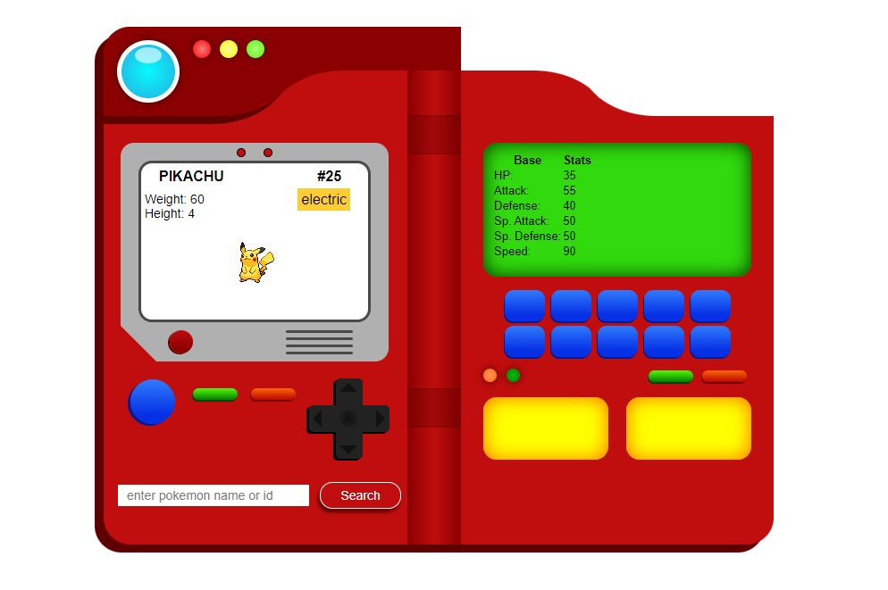

# Pokémon Search Pokédex App

## Description

The Pokémon Search Pokédex App is a web application designed to replicate the look and feel of the Pokédex from the Pokémon animation series. The app uses the FreeCodeCamp Pokémon API to fetch details about various Pokémon by their name or ID. It is fully responsive, adapting to different screen sizes, and includes a unique feature where the Pokédex is closed in mobile view and can be opened with a click.

## Features

- Fetch Pokémon details using the FreeCodeCamp Pokémon API.
- Responsive design mimicking the Pokédex from the Pokémon animation series.
- Mobile view with a closable and openable Pokédex.
- Smooth animations and transitions.

## Installation

1. Clone the repository:
   ```bash
   git clone [https://github.com/YashJunagade/Pokemon-Search-App-Pokedex.git]
   ```
2. Navigate to the project directory:
   ```bash
   cd Pokemon-Search-App-Pokedex
   ```
3. Open the `index.html` file in your preferred browser.

## Usage

1. Enter the name or ID of the Pokémon you want to search for in the search bar.
2. The app will display the details of the Pokémon including its name, type, abilities, and an image.
3. On mobile devices, tap the Pokédex to open or close it.

## Screenshots





## Video Demonstration

Here's a video demonstration showing the responsiveness and features of the Pokémon Search Pokédex App:


## Contact

For questions or feedback, please reach out at [yash.junagade1900@gmail.com]
